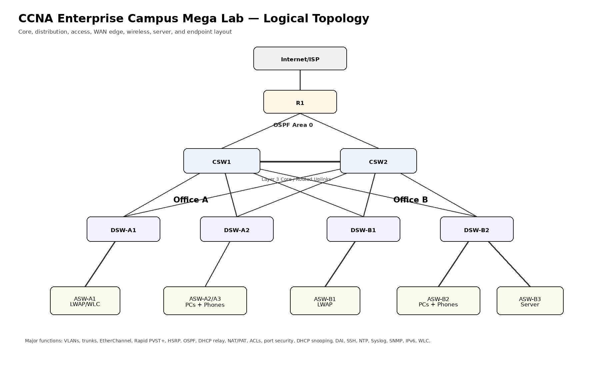

# CCNA Enterprise Campus Mega Lab

## Overview
This repository documents a complete Cisco Packet Tracer campus implementation built as a single integrated lab. It combines switching, routing, first-hop redundancy, services, security controls, wireless, and IPv6 in one two-office topology. The project is structured for technical review with the Packet Tracer file, sanitized running configurations, implementation notes, and validation commands.

## Lab Objectives
- Build a hierarchical core/distribution/access campus topology
- Segment traffic with VLANs for users, voice, servers, wireless, and management
- Provide redundant L2/L3 paths with EtherChannel, HSRP, and OSPF
- Implement DHCP relay, NAT/PAT, SSH management, SNMP/Syslog/NTP
- Apply access-layer protections with Port Security, DHCP Snooping, and DAI
- Integrate WLC/LWAP wireless services and IPv6 routing

## Topology


## Device Roles
| Device | Role |
|---|---|
| R1 | Internet edge, DHCP, NAT/PAT, OSPF default route source, NTP master |
| CSW1 | Core L3 switch, OSPF backbone, routed uplinks, inter-core L3 EtherChannel |
| CSW2 | Core L3 switch, OSPF backbone peer, routed uplinks |
| DSW-A1 / DSW-A2 | Office A distribution, SVIs, HSRP gateways, ACL enforcement |
| DSW-B1 / DSW-B2 | Office B distribution, SVIs, HSRP gateways |
| ASW-A1/A2/A3 | Office A access, endpoint/AP attachment, L2 security controls |
| ASW-B1/B2/B3 | Office B access, endpoint/AP/server attachment |
| WLC1 | Central wireless controller |
| LWAP1 / LWAP2 | Lightweight APs for Office A and Office B |
| SRV1 | Server endpoint (DNS/Syslog/SNMP/FTP roles in lab scope) |

## VLAN and IP Addressing Plan
### Office A
| VLAN | Purpose | Subnet | HSRP VIP |
|---|---|---|---|
| 99 | Management | 10.0.0.0/28 | 10.0.0.1 |
| 10 | PCs | 10.1.0.0/24 | 10.1.0.1 |
| 20 | Phones | 10.2.0.0/24 | 10.2.0.1 |
| 40 | Wireless | 10.6.0.0/24 | 10.6.0.1 |

### Office B
| VLAN | Purpose | Subnet | HSRP VIP |
|---|---|---|---|
| 99 | Management | 10.0.0.16/28 | 10.0.0.17 |
| 10 | PCs | 10.3.0.0/24 | 10.3.0.1 |
| 20 | Phones | 10.4.0.0/24 | 10.4.0.1 |
| 30 | Servers | 10.5.0.0/24 | 10.5.0.1 |

## Implementation

### 1. Basic Device Hardening
**Purpose:** Standardize secure device management.
**What was configured:** Local admin account, encrypted enable secret, SSHv2, local login on console/VTY, Telnet disabled.
**Key commands:** `enable secret`, `username ... secret`, `ip ssh version 2`, `transport input ssh`.
**Validation:** `show running-config | section line vty`, `show ip ssh`.

### 2. VLAN Segmentation
**Purpose:** Separate broadcast domains and policy boundaries.
**What was configured:** VLANs 10/20/30/40/99 for PCs, phones, servers, wireless, and management.
**Key commands:** `vlan`, `switchport access vlan`, `switchport voice vlan`.
**Validation:** `show vlan brief`.

### 3. Trunking and Native VLAN Design
**Purpose:** Carry required VLANs between switches with controlled VLAN propagation.
**What was configured:** 802.1Q trunks, explicit allowed VLANs, defined native VLANs, `nonegotiate` on trunks.
**Validation:** `show interfaces trunk`.

### 4. EtherChannel
**Purpose:** Increase link resilience and bandwidth on key inter-switch links.
**What was configured:**
- DSW-A1 ↔ DSW-A2: Layer 2 EtherChannel, PAgP desirable, Port-channel1
- DSW-B1 ↔ DSW-B2: Layer 2 EtherChannel, LACP active, Port-channel1
- CSW1 ↔ CSW2: Layer 3 EtherChannel, PAgP desirable, Port-channel1 (`10.0.0.41/30` ↔ `10.0.0.42/30`)
**Validation:** `show etherchannel summary`, `show interfaces port-channel 1`.

### 5. Spanning Tree Protocol
**Purpose:** Prevent loops and align forwarding with gateway design.
**What was configured:** Rapid PVST+ on the active Layer 2 switching domain/distribution-access layer with root role tuning.
- DSW-A1 root priority 0 for VLANs 10/99, 4096 for VLANs 20/40
- DSW-B1 root priority 0 for VLANs 10/99, 4096 for VLANs 20/30
**Validation:** `show spanning-tree root`.

### 6. Inter-VLAN Routing and HSRP
**Purpose:** Provide redundant default gateways and SVI routing at distribution.
**What was configured:** HSRPv2 on distribution SVIs with split active roles by VLAN.
**Validation:** `show standby brief`, `show ip interface brief`.

### 7. OSPF Dynamic Routing
**Purpose:** Advertise campus routes across edge/core/distribution routed links.
**What was configured:** OSPF process 1, area 0, loopback router IDs, passive user VLAN SVIs, point-to-point network type on routed links.
- R1 runs interface-level OSPF on Loopback0, G0/0, G0/1 and uses `default-information originate`
- CSW1 uses host-specific network statements with wildcard `0.0.0.0`
- DSW-A1 and DSW-B1 use loopback router IDs with passive user SVIs
**Validation:** `show ip ospf neighbor`, `show ip route ospf`.

### 8. Static and Floating Default Routes
**Purpose:** Ensure primary and backup WAN path behavior.
**What was configured:** Primary static default route and floating backup default route on R1 for IPv4 and IPv6.
**Validation:** `show ip route`, `show ipv6 route`.

### 9. DHCP and DHCP Relay
**Purpose:** Centralize address assignment while keeping SVIs distributed.
**What was configured:** R1 DHCP pools A-Mgmt, A-PC, A-Phone, B-Mgmt, B-PC, B-Phone, Wi-Fi; helper addresses on distribution SVIs.
**Validation:** `show ip dhcp binding`, `show running-config | section ip dhcp`.

### 10. DNS
**Purpose:** Provide name resolution for clients and managed devices.
**What was configured:** DNS server reference to SRV1 (`10.5.0.4`) in DHCP pools and device name-server settings.
**Validation:** host DNS lookup tests and DHCP option checks.

### 11. NTP
**Purpose:** Keep consistent device time across the topology.
**What was configured:** R1 configured as `ntp master 5`; switches configured to sync with R1 using NTP key trust.
**Validation:** `show ntp status`, `show ntp associations`.

### 12. Syslog and SNMP
**Purpose:** Centralize logs and monitoring.
**What was configured:** Syslog remote target `10.5.0.4`; SNMP read-only community configured on infrastructure devices.
**Validation:** `show logging`, `show snmp`.

### 13. FTP and IOS Image Management
**Purpose:** Support image transfer and backup workflows.
**What was configured:** FTP client credentials on R1 for transfer operations.
**Validation:** transfer workflow checks in Packet Tracer.

### 14. SSH Remote Management
**Purpose:** Restrict management plane to encrypted sessions.
**What was configured:** SSH version 2 enforced, `transport input ssh`, VTY ACL 1.
- ACL 1 permits `10.1.0.0/24`
**Validation:** `show ip ssh`, `show access-lists 1`.

### 15. NAT and PAT
**Purpose:** Provide outbound Internet access and internal service publishing.
**What was configured:**
- NAT outside: R1 `G0/0/0` and `G0/1/0`
- NAT inside: R1 `G0/0` and `G0/1`
- Static NAT: `10.5.0.4` -> `203.0.113.113`
- PAT pool: `203.0.113.200-203.0.113.207` (/29)
- ACL 2 permits `10.1.0.0/24`, `10.2.0.0/24`, `10.3.0.0/24`, `10.4.0.0/24`, `10.6.0.0/24`
**Validation:** `show ip nat translations`, `show access-lists 2`.

### 16. CDP and LLDP
**Purpose:** Limit unnecessary discovery exposure while preserving standards-based visibility.
**What was configured:** CDP disabled and LLDP enabled on devices where applied.
**Validation:** `show cdp`, `show lldp neighbors`.

### 17. ACLs
**Purpose:** Control selected inter-office traffic paths.
**What was configured:** Standard ACL 1 for VTY restriction and extended ACL policy at distribution.
**Validation:** `show access-lists`.

### 18. Port Security
**Purpose:** Limit unauthorized endpoint attachment at access ports.
**What was configured:** Sticky MAC with violation controls on host-facing ports.
**Validation:** `show port-security`, `show port-security address`.

### 19. DHCP Snooping
**Purpose:** Block rogue DHCP behavior.
**What was configured:** Snooping enabled on user VLANs with trusted uplinks.
**Validation:** `show ip dhcp snooping`.

### 20. Dynamic ARP Inspection
**Purpose:** Mitigate ARP spoofing on user segments.
**What was configured:** DAI enabled on user VLANs with trusted uplinks.
**Validation:** `show ip arp inspection`.

### 21. IPv6
**Purpose:** Add dual-stack routing capability on routed links.
**What was configured:** `ipv6 unicast-routing`, IPv6 interface addressing, IPv6 primary and floating defaults on edge.
**Validation:** `show ipv6 interface brief`, `show ipv6 route`.

### 22. Wireless LAN Controller
**Purpose:** Centralized WLAN control across both offices.
**What was configured:** WLC1 connected in Office A (ASW-A1), LWAP1 on ASW-A1, LWAP2 on ASW-B1, AP discovery via DHCP Option 43 to `10.0.0.7`, WLAN user mapping to VLAN 40.
**Validation:** WLC AP summary, WLC client summary, WLAN-to-interface mapping review.

## Security Controls Summary
| Control | Implementation |
|---|---|
| SSH-only remote access | `transport input ssh`, `ip ssh version 2` |
| VTY source restriction | ACL 1 permits `10.1.0.0/24` |
| Port Security | Sticky MAC and violation policy on access ports |
| DHCP Snooping | Enabled on user VLANs with trusted uplinks |
| DAI | Enabled on user VLANs with inspection trust model |
| SNMP hardening | Read-only community |
| Discovery control | CDP disabled, LLDP enabled where configured |

## Verification Commands Used / Validation Checklist
See: [`verification/validation-checklist.md`](verification/validation-checklist.md)

## Troubleshooting Notes Summary
Detailed troubleshooting workflow is documented in:
- [`docs/troubleshooting-notes.md`](docs/troubleshooting-notes.md)

## Repository Structure
```text
CCNA-Enterprise-Campus-Mega-Lab/
├── README.md
├── LICENSE
├── .gitignore
├── packet-tracer/
│   ├── ccna-enterprise-campus-mega-lab.pkt
│   └── README.md
├── configs/
│   ├── routers/R1-running-config.txt
│   ├── core-switches/CSW1-running-config.txt
│   ├── distribution-switches/DSW-A1-running-config.txt
│   ├── distribution-switches/DSW-B1-running-config.txt
│   └── access-switches/
│       ├── ASW-A1-running-config.txt
│       └── ASW-B1-running-config.txt
├── diagrams/
│   ├── logical-topology.mmd
│   ├── physical-connections.md
│   ├── vlan-ip-plan.md
│   ├── ospf-routing-design.md
│   ├── hsrp-stp-alignment.md
│   └── wireless-wlc-capwap-flow.md
├── docs/
│   ├── implementation-details.md
│   ├── troubleshooting-notes.md
│   └── lessons-learned.md
└── assets/screenshots/packet-tracer-topology.png
```

## How to Review This Repo
1. Open the topology image and Mermaid diagram for structure.
2. Review `configs/` for the sanitized running configs used as source of truth for key devices.
3. Read implementation rationale in `docs/implementation-details.md`.
4. Use `verification/validation-checklist.md` as the command-by-command validation reference.
5. Review troubleshooting and lessons learned for operational context.
